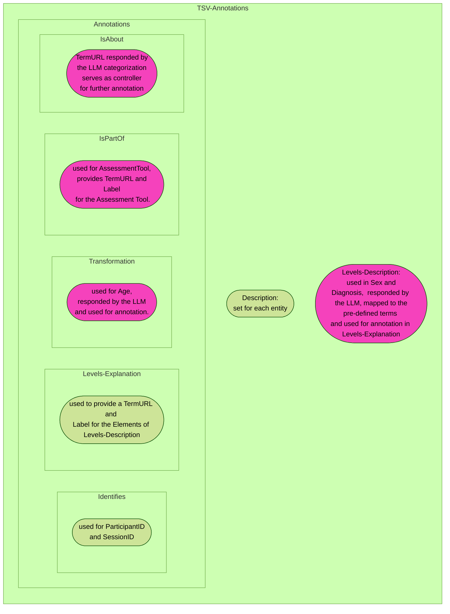

# Annotation Tool AI


[Neurobagel's](https://www.neurobagel.org/) annotation tool-ai project aims at  taking BIDS-style [phenotypic data](https://github.com/neurobagel/annotation_tool/blob/main/cypress/fixtures/examples/good/ds003653_participant.tsv) and [corresponding data description files](https://github.com/neurobagel/annotation_tool/blob/main/cypress/fixtures/examples/good/ds003653_participant.json) and gives users a first pass annotation by employing LLMs which use the Neurobagel data model for preparation to inject that modeled data into Neurobagel's graph database for [federated querying](https://github.com/neurobagel/query-tool).

We are attempting to achieve this automation using LLMs (at present gemma) and various libraries like Pydantic.


[Local Installation](#local-installation) |
[Dockerized version](#dockerized-version) |
[Details of the codebase ](#details-of-the-codebase) |
[License](#license)


## Local Installation

### Building and running

- clone the repo

`git clone https://github.com/neurobagel/annotation-tool-ai`

- create virtual environment

 ```python3 -m venv venv```

 ```source venv/bin/activate```

- set up pre-commit ( flake8, black, mypy)

 ```pre-commit install```

- Install ollama (Currently the tool is supported only on linux ) 

```curl -fsSL https://ollama.com/install.sh | sh```


- complete installations 
 ```pip install -r requirements.txt```

To run the current version of the LLM-based Annotation Tool execute
the following two commands:

```
python3 app/api.py --host 127.0.0.1 --port 8000 #to start the local uvicorn instance
curl -X POST "http://127.0.0.1:8000/process/?code_system=snomed" -F "file=@your-file.tsv" -o downloaded_file.json #to test the tool
```

| param | value | info  |   
|---|---|---|
|`code_system`| `cogatlas`  | If assessment tools are identified within the provided `.tsv` file, the TermURLs and Labels from the [Cognitive Atlas](https://www.cognitiveatlas.org/) are assigned (if available). `cogatlas` is the default value.   |
|   | `snomed`  | If assessment tools are identified within the provided `.tsv` file, the TermURLs and Labels from [SNOMED CT](https://www.snomed.org/) are assigned (if available).    |


 

## Dockerized version

Since the annotation tool uses ollama to run the LLM it has to be provided by the docker container.
This is done by extending the available [ollama container](https://hub.docker.com/r/ollama/ollama)
For this instructions it is assumed that [docker](https://www.docker.com/) is installed.

## Build the image

The container can be built from the dockerfile available in the repo

```bash
docker build -t annotation-tool-ai .
```
Let's break down the command:

- `docker build`: According to the instructions in the `Dockerfile` this command builds the image.
- `-t `: This flag allows you to name (or tag) an image. 
- `annotation-tool-ai`: This is the nice name for the image

## Run the container from the built image

```bash
docker run -d 
-v ollama:/root/.ollama 
-v /some/local/path/output:/app/output/  
--name instance_name
-p 8000:8000 
annotation-tool-ai
```

Let't break down the command:

- `docker run -d`: The -d flag runs the container in the background without any output in the terminal.
- `-v ollama:root/.ollama`: The -v flag mounts external volumes into the container. In this case the models used within the container are stored locally as well as *Docker volumes* - these are created and managed by Docker itself and is not directly accessible via the local file system.
- `-v /path/to/some/local/folder/:/app/output/`: This is a bind mount (also indicated by the -v flag) and makes a local directory accessible to the container. Via this folder the input and output files (i.e. the `.tsv` input and `.json` output files) are passed to the container but since the directory is mounted also locally accessible. Within the container the files are located in `app/output/`. For more information about Docker volumes vs. Bind mounts see [here](https://www.geeksforgeeks.org/docker-volume-vs-bind-mount/).
- `--name instance-name`: Here you choose a (nice) name for your container from the image we created in the step above.
- `-p 8000:8000`: Mount port for API requests inside the container
- `annotation-tool-ai`: Name of the image we create the instance of.

## Execute the annotation script

The following command runs the script for the annotation process:

```
docker exec -it api_test curl -X POST "http://127.0.0.1:8000/process/?code_system=<snomed | cogatlas>" -F "file=@<filepath-to-tsv-inside-container>.tsv" -o <filepath-to-output-file-inside-container>.json
```

Let's break down this again:
- `docker exec`: This command is used to execute a command in a running Docker container.
- `-it`: Here are the `-i` and `-t` flag combined which allows for interactive terminal session. It is needed, for example, when you run commands that require input.
- `api_test`: Name of the instance. 
- `curl -X POST "http://127.0.0.1:8000/process/?code_system=<snomed | cogatlas>" -F "file=@<filepath-to-tsv-inside-container>.tsv" -o <filepath-to-output-file-inside-container>.json`: This is the command you want to execute in the interactive terminal session within the container. The input file is the to-be-annotated `.tsv` file and the output file is the `.json` file.

# Details of the codebase 

### Currently the development of the tool is divided into 2 aspects: Parsing and Categorization

[Parsing](#Parsing) |
[Categorization](#Categorization) |

## Parsing

### Introduction

The codebase is designed to handle and annotate TSV data by converting it into JSON format. It leverages the Pydantic library to enforce data structures, ensuring the consistens and valid data throughout the annotation process.
The main components of the code include defining data structures for various annotation categories, handling the annotation of the categories itself and create a JSON file containing the annotations. The scope of this milestone was to create annotations for the entities available in the current Neurobagel data model (i.e., ParticipantID, SessionID, Age, Sex, Diagnosis, and Assessment Tool). 

### Assumptions and Requirements

Since we have separated the categorization and parsing steps, some assumptions have been made about the format of the LLM response for the different data model entities. The goal was to produce correct annotations with a minimum of information. Thus, the following LLM responses are assumed for the different entities:

- Participant ID: `{"TermURL":"nb:ParticipantID"}`
- Session ID: `{"TermURL":"nb:Session"}`
- Age: 
```
    {
    "TermURL": "nb:Age", 
    "Format": "europeanDecimalValue"
    }
```
- Sex:
```
{
    "TermURL": "nb:Sex",
    "Levels": {
        "M": "male",
        "F": "female"
    }
}
```

- Diagnosis:
```
{
    "TermURL": "nb:Diagnosis",
    "Levels": {
        "MDD": "Major depressive disorder",
        "CTRL": "healthy control"
    }
}
```

- Assessment Tool:
```
{
    "TermURL": "nb:AssessmentTool",
    "AssessmentTool": "future events structured interview"
}

```

By now the code depends on 
- `typing` for providing type hints for defined functions. (required for mypy)
- `pandas` TSV file handling
- `json` JSON handling
- `pydantic` for data validation and modularized parsing

### Representing Data Model Entities

Conceptually, the desired JSON output has a common base for all entities (i.e. the `IsAbout` section), but depending on the entity being handled, different additional fields are present. For instance, the example below demonstrates that the `participant_id` contains the additional field `Identifies` and the `age` contains the additional fields `Transformation` and `MissingValues` but does not contain the `Identifies` entry.


```json
{
    "participant_id": {
        "Description": "A participant ID",
        "Annotations": {
            "IsAbout": {
                "Label": "Subject Unique Identifier",
                "TermURL": "nb:ParticipantID"
            },
            "Identifies": "participant"
        }
    },
    "age": {
        "Annotations": {
            "IsAbout": {
                "Label": "Age",
                "TermURL": "nb:Age"
            },
            "Transformation": {
                "Label": "integer value",
                "TermURL": "nb:FromInt"
            },
            "MissingValues": []
        },
        "Description": "The age of the participant at data acquisition"
    }
}
```

To keep the code readable, a separate class was defined for each entity to be annotated. The common base in the desired output - the `IsAbout` section, which contains two strings (a TermURL and a Label), serves as the initial data structure for all entities in the data model. Subsequently, the `IsAbout` base model is further differentiated for each data model entity (e.g., `IsAboutParticipant`, `IsAboutSession`, etc.) and adds the specific (static) label to it. 

```python
class IsAboutBase(BaseModel):
    Label: str
    TermURL: str
    
class IsAboutParticipant(IsAboutBase):
    Label: str = Field(default="Subject Unique Identifier")
    TermURL: str   
```

The `IsAbout` section is encapsulated in the `Annotations` section, but here potentially different fields can be included.
To implement this, another data structure has been defined that contains the specific `IsAbout` section (depending on the `TermURL' entry returned by the LLM) and all the optional fields.

```python
class Annotations(BaseModel):  
    IsAbout: Union[
        IsAboutParticipant,
        IsAboutSex,
        IsAboutAge,
        IsAboutSession,
        IsAboutGroup,
        IsAboutAssessmentTool,
    ]
    Identifies: Optional[str] = None
    Levels: Optional[Dict[str, Dict[str, str]]] = None
    Transformation: Optional[Dict[str, str]] = None
    IsPartOf: Optional[Dict[str, str]] = None
```

As a final step in creating the JSON output format, fields such as `Description` and, in the case of categorical variables (optional), the `Levels` present in the TSV file should be added. To implement this, another data structure was introduced that contains these fields and the `Annotations` (which in turn contains the `isAbout`).

```python
class TSVAnnotations(BaseModel):
    Description: str
    Levels: Optional[Dict[str, str]] = None
    Annotations: Annotations
```

Based on the data structures described above, annotations can be composed for each entity. Here is a graphical representation of the data structures and how they are used for the final TSV annotation. The pink boxes represent fields that depend on the LLM response.


### Functions

Creating the desired JSON output requires several steps. 
These include:


| Function | Purpose | Parameters |
| -------- | -------- | -------- |
| `convert_tsv_to_dict` | Extract the original column names (and their contents - for LLM queries) from the TSV file. This serves as a preparation step for the query passed to the LLM, as well as for the creation of the "raw" JSON file. | Input: <br> `tsv_file:str` <br> <br>Output: `column_strings:Dict[str,str]`|
|`tsv_to_json` | This function initializes a JSON file with the columns of the TSV file as keys and empty strings as values. | Input: <br> `tsv_file:str` <br> `json_file:str` <br> <br> Output: <br> `None`|
| |       LLM Categorization (see [here](https://hackmd.io/QymmEdIoTk-2g7-JNMq2lA#LLM-Utilisation--Annotation-Tool-AI-Documentation))       |
|`process_parsed_output` | This function decides which handler function to call based on the TermURL of the LLM response.| Input: <br> `llm_output:Dict[str, Union[str, Dict[str, str], None]]` <br><br>`levels_mapping:Mapping[str, Dict[str, str]]` <br><br> Output: <br> `TSVAnnotations:Union[str, TSVAnnotations]`
|`handle_participant` <br> `handle_age` <br> `handle_categorical` <br> `handle_session` <br> `handle_assessmentTool` | These functions create specific annotation instances to ensure that each annotated column contains only the fields required for it.|Input ParticipantID, Session, Age:<br> `llm_response:Dict[str, Any]` <br> Input Sex, Diagnosis, Assessment Tool: <br> `llm_response:Dict[str, Any]` <br> `mapping:Mapping[str, Dict[str, str]]` <br> <br> Output: <br> `TSVAnnotations`|
|`load_levels_mapping`<br> `load_assessmenttool_mapping` | These helper functions provide the mappings (i.e., the corresponding TermURLs to a specific label such as "Male" or "Alexia"). For diagnosis and sex the `load_levels_mapping` is used. For the assessment tool the `load_assessmenttool_mapping` is used. Two functions are needed because the original structure of the files (`diagnosisTerms.json` and `toolTerms.json`) is slightly different.| Input:<br> `mapping_file:str` <br> <br> Output: <br> `levels_mapping \|assessmenttool_mapping:Mapping[str, Dict[str, str]]`
|`update_json_file` | Updates the "raw" JSON file with the processed data under the specific key (i.e. the original column name).| Input: <br> `data: Union[str, TSVAnnotations]` <br>`filename: str`<br>`target_key: str` <br><br> Output: <br> `None`

## Main Script

Here the main script demonstrates the complete process of annotating each column of the `TSV` file.

```python 
def main(file_path: str, json_file: str) -> None:
    columns_dict = convert_tsv_to_dict(file_path)

    tsv_to_json(file_path, json_file)

    # Create output for each column
    for key, value in columns_dict.items():
        print("Processing column:", key)
        try:
            # Invoke the chain with the input data
            input_dict = {key: value}
            print(key)
            # Column information is inserted in prompt template
            llm_response = llm_invocation(input_dict)

        except Exception as e:
            print("Error processing column:", key)
            print("Error message:", e)
            continue

        result = process_parsed_output(llm_response)
        print(result)
        update_json_file(result, json_file, key)


if __name__ == "__main__":
    parser = argparse.ArgumentParser(
        description="Process TSV file and update JSON output."
    )
    parser.add_argument("file_path", type=str, help="Path to the TSV file")
    parser.add_argument(
        "json_file", type=str, help="Path to the output JSON file"
    )

    args = parser.parse_args()

    main(args.file_path, args.json_file)


```

## Categorization:

### Introduction
Categorization is carried out using LLMS and this step return the required structure of output for furhter processing .The codebase is created to categorize/classify the columns present in the tsv input file into classes according to the already existing categories present in the neurobagel annotation tool. The LLM makes it predictions for a specific input string consisting of the column header and the column contents based on the examples provided to it beforehand in its promptemplate.
The various tasks carried out by this codebase mainly utilise Langchain,
the json library from python and the LLM 'Gemma' from Ollama.

### Important Aspects:

#### 1. Choice of LLM
#### 2. Utilising Langchain and a well structured Prompt Template
#### 3. Obtaining the Output in the req format to pass it on to the parser

# 
#

### 1.Choice of LLM:

The choice of LLM was a very crucial aspect as it was necessary to select an LLM that hallucinates the least and has a freedom to be used enumerably without any limit.

1. The LLMs from hugging face:
Even though we get to use  many LLMs like Flant-T5 for free on Hugging face it had an API request Limit and hence a conclusion was made that such an approach is not feasible for something to be sent to production.Thereafter we have been using LLMs from Ollama for the project.

2. Llama2/Llama3

Even though Llama models appeared to work fine at first, hallucination was detected when tested further 
The attatched Screenshots show the LLM response in the interval of abt 10-20 seconds


3. Gemma Model
The gemma model also from Ollama is working  fine with no visible hallucinations until now. And further tasks are being carried out using the Gemma model.

However an open mind has been kept in context of the choice of LLM and we keep on testing new LLMs that we come across because there can always be a scope of improvement in this context.

### 2. Utilising Langchain and a well structured Prompt Template

Utilizing LangChain’s components like PromptTemplate, ChatOllama  and implementing chains provides a robust framework for developing and deploying  our application.

1. PromptTemplate:

Here the PromptTemplate specifies the input form examples for the LLM to base the response on and the form in which the output is expected.
It also seperately defines the input variables that will be given to the LLM.


2. Chatollama

Chatollama from langchain_community.chat_models was used to implement various LLMs from Ollama.


3. The Chain
In LangChain, the concept of chains refers to a sequence or pipeline of operations applied to data. Chains in LangChain are flexible, allowing developers to incorporate various components (like ChatOllama, PromptTemplate, data parsers, etc.) into customized workflows. The ' chain.invoke(...)' function executes each operation in the defined chain sequentially.
 

 
 

### 3. Obtaining the Output in the req format to pass it on to the parser

This depends on the type of values present in the column ie categorical, defined numeric indices, Continuos etc

The LLM output is of the form of 'AI_Model Object' so it was required to convert it into string object in order to further process the LLM output to obtain the required structered output from the code.

So funtions (SexLevel(...) and AgeFormat(....) ) are defined for different types of columns which require extra identification other than the labelling done by the LLM also the output has been structured in a way that is required by the parser using the 'json.dumps()' function.


The following Screenshot is the output of a test code before integrating the codebase with the parsing code 


## License

The Neurobagel Annotation-tool-AI  uses the [MIT License](https://github.com/neurobagel/annotation-tool-ai/blob/main/LICENSE).


